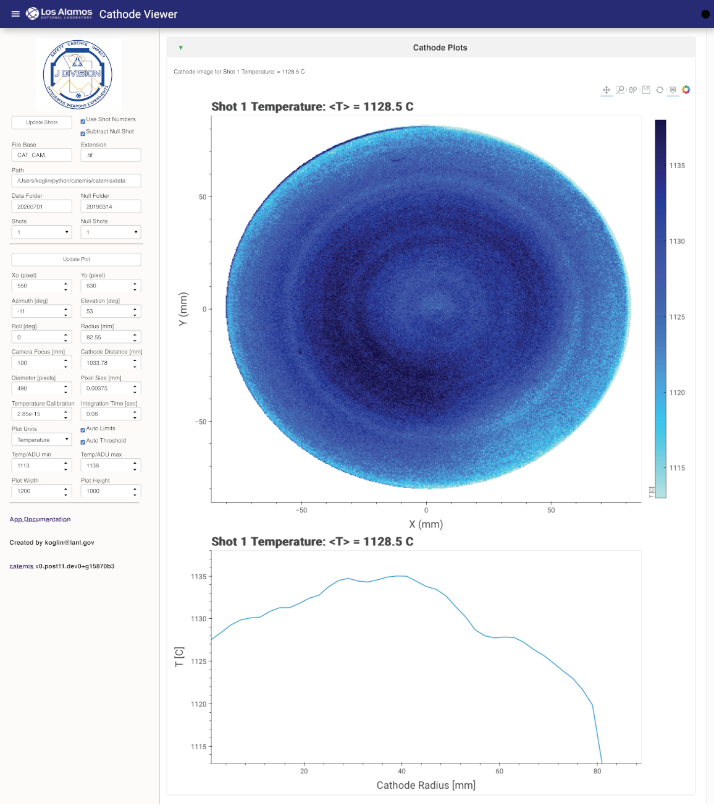

.. currentmodule:: catemis

==============
Cathode Viewer
==============

Interactive application for viewing Cathode camera data

Launching the Cathode Viewer App
--------------------------------

Start the cathode camera viewer app from the catemis\\panel directory (remember to activate catemis environment for each new window)::

    $ panel serve --show cathode_viewer.ipynb --port=5051

.. _cathode_veiwer:

   Cathode Viewer Application

Steps for using the Cathode Viewer application.
    + Optionally set the path for the data.  The default is data included in the catemis package for the WESJ paper.
    + Optionally set the Data Folder of the image data
    + Optionally set the Null Folder of the null image used for baseline background subtraction
    + Select shot numbers for cathode image from Shots dropdown list
    + Optionally select the null shot from the Null Shots dropdown list
    + Update Plot after selecting a new shot number
    + Optionally unclick 'Use Shot Numbers' to view lists of files instead of shot numbers determined from file names 
      (this may be needed depending on naming convention used).

Image Analysis
--------------

Aspect corretions can be applied to the cathode image.  The defaults are for the images in the WESJ paper.

Image analysis options.
    + Xo:  pixel x origin
    + Yo:  pixel y origin
    + Azimuth:  Camera azimuth rotation angle [deg]
    + Elevation:  Camera alevation rotation angle [deg]
    + Roll:  Camera Roll angle [deg]
    + Radius:  Cathode radius [mm]
    + Camera Focus:  Camera focal distance [mm]
    + Camera Distance:  Camera to cathode distance [mm]
    + Diameter:  Cathode diameter on camera in number of pixels
    + Pixel Size:  Camera pixel size [mm]
    + Temperature Calibration:  Camera calibration factor
    + Integration Time:  Camera integration time (for scaling separate from Temperature Calibration) [sec]

Plotting Parameters
-------------------

The cathode image plot can be adjusted with several options.  
The default is to automatically set the color scale and only plot the cathode camera surface.

Plotting parameters.
    + Temp/ADU min:  Minimum color scale temperature or ADU 
    + Temp/ADU max:  Miximum color scale temperature or ADU 
    + Auto Limits:  Automatically set limits
    + Auto Threshold:  Automatically theshold at cathode edges
    + Plot Width:  Plot width in display pixels
    + Plot Height:  Plot height in display pixels

