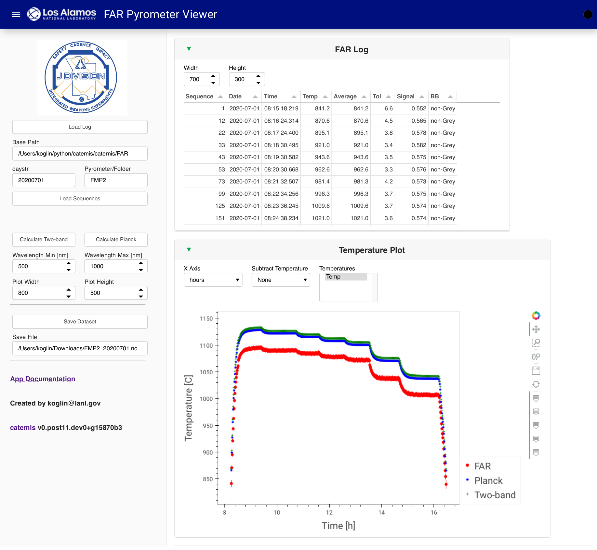
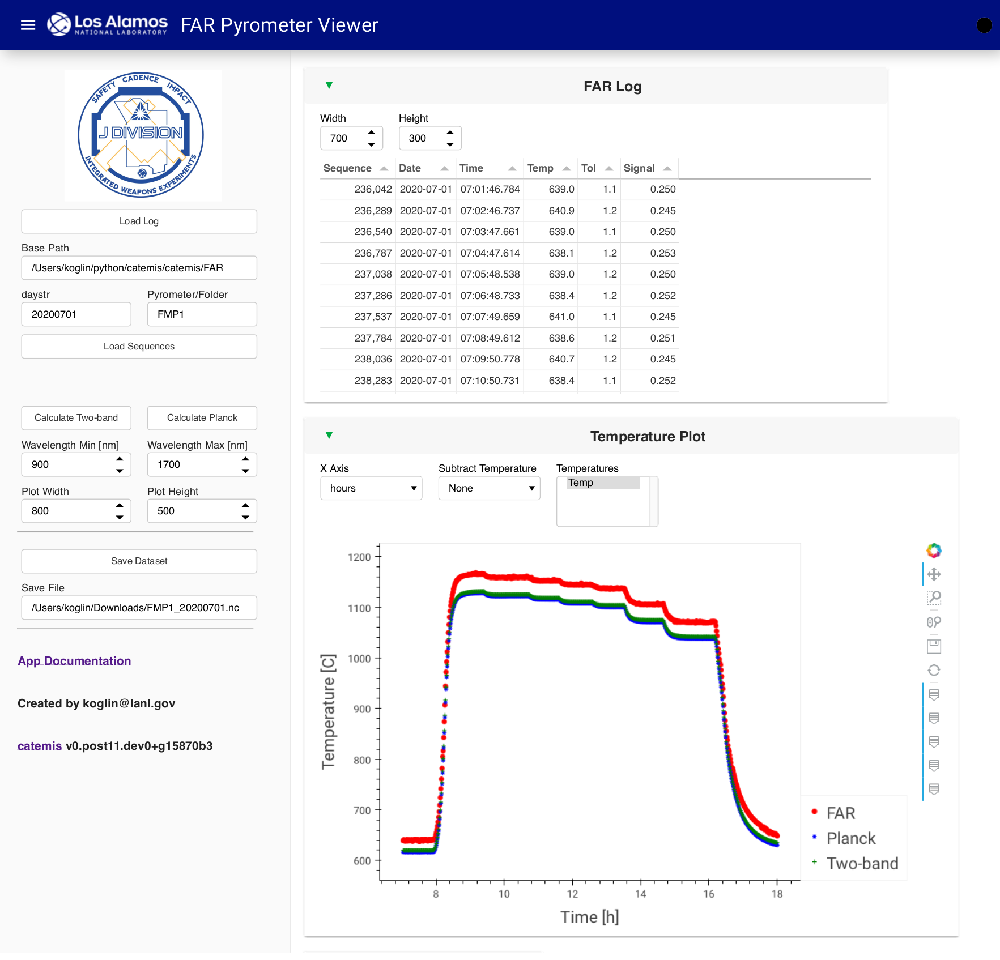
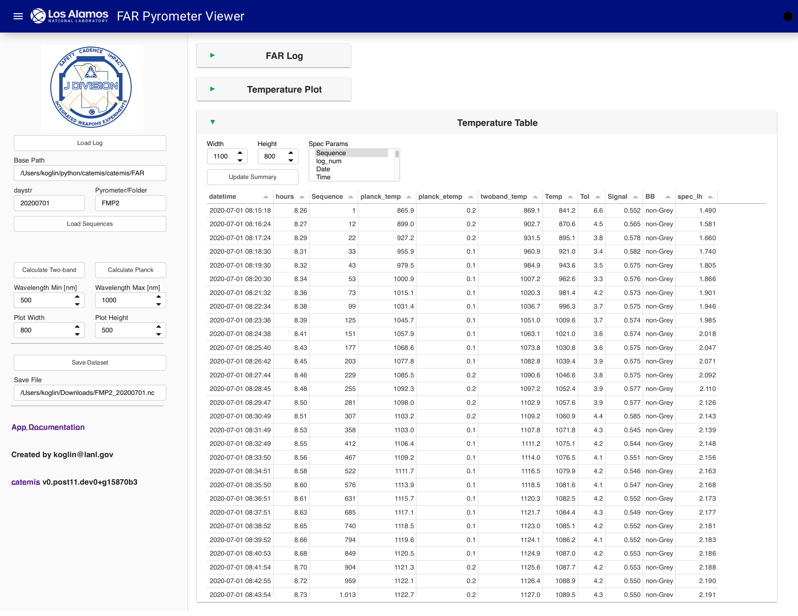
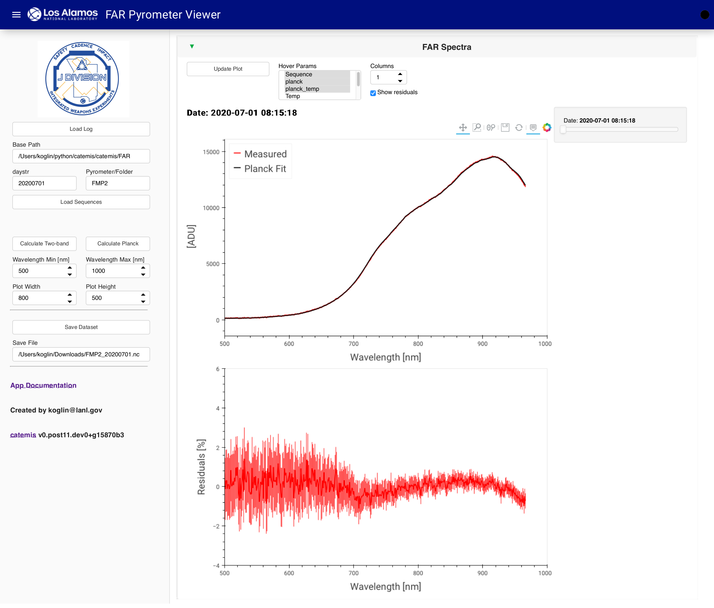
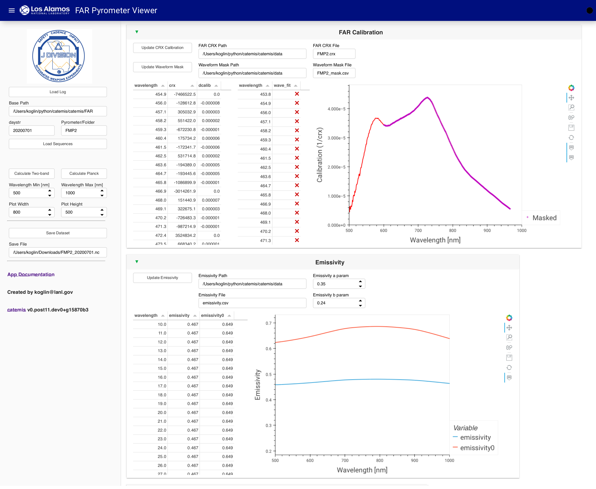
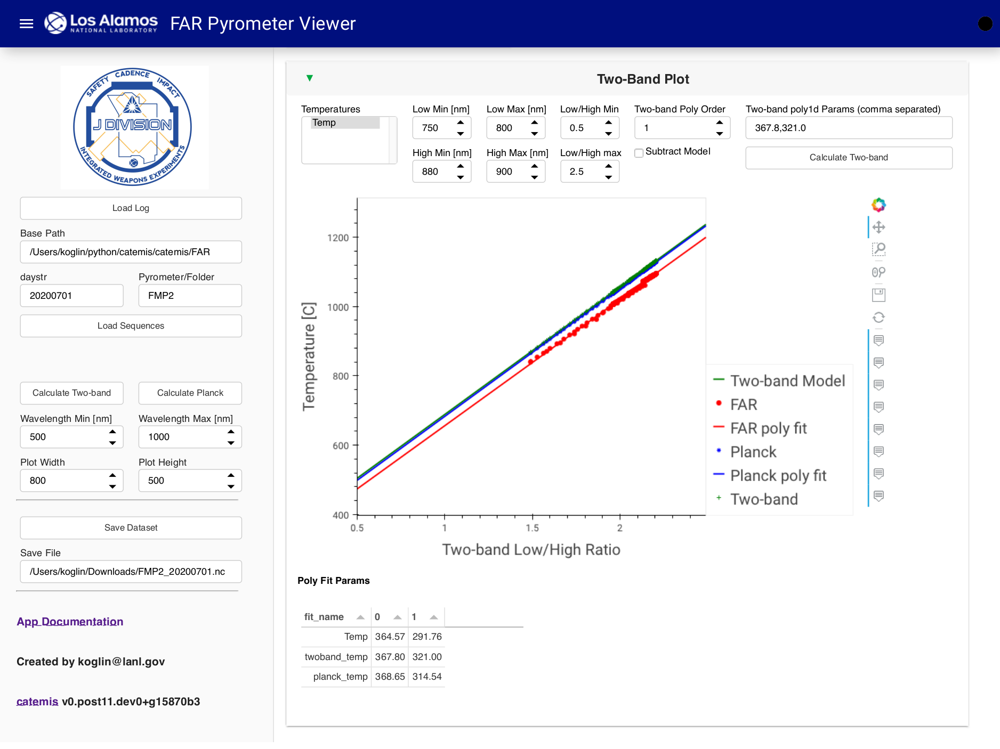
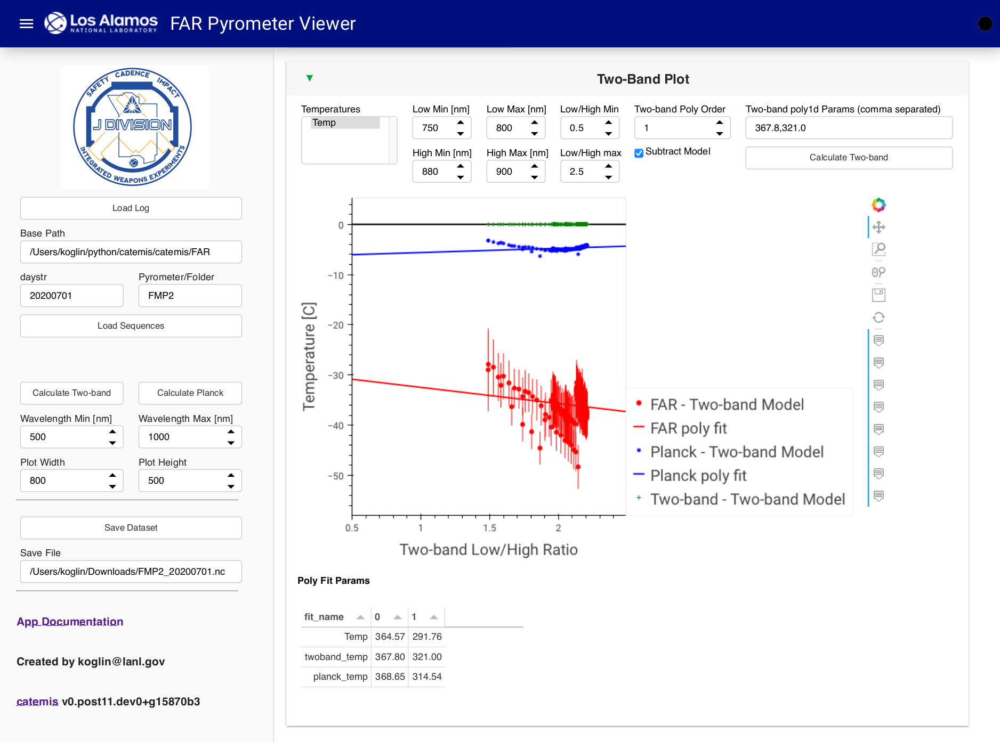

.. currentmodule:: catemis

==========
FAR Viewer
==========

Interactive application for viewing Cathode camera data

Launching the Cathode Viewer App
--------------------------------

Start the FAR pyrometer viewer app from the catemis\\panel directory (remember to activate catemis environment for each new window)::

    $ panel serve --show far_viewer.ipynb --port=5052

.. _far_veiwer:

   FAR Pyrometer Viewer Application with FMP2 data from WESJ paper.

Steps for using the FAR Pyrometer Viewer application.
    + Optionally update Base Path of FAR data
    + Optionally update Pyrometer/Folder in Base Path
    + Optionally update day data was taken with yyyymmdd format
    + Click on Load Log to load log data from the appropriate file 
      in the Log subfolder of the Pyrometer/Folder
    + Click on individual sequences or a range of sequences for processing.
    + Click on 'Load Sequences' to load the selected sequences 
      or if none were selected then load all sequences in the log files
      for the specified date.
    + Click on 'Calculate Two-band' to perform a fast calculation 
      of the temperature with the Two-band method
    + Click on 'Calculate Planck' to perform a much slower calculation
      of the temperature with the Planck fitting method
      (expect a few spectral sequences calculated per second)

The FMP1 data from the WESJ paper can be loaded simply by changing the Pyrometer/Folder to 'FMP1',
clicking the 'Load Log' button followed by the 'Load Sequences' butoon.
In the plot below, the two-band and planck temperatures are shown
(note that to calculate all the Planck temperatures for an entire day may take several minutes).

   FAR Pyrometer FMP1 data from WESJ paper

Temperature Table
-----------------

A table of the temperatures for the loaded sequences is available in a tab below the FAR Log and Temperature Plot.

   FAR Pyrometer Temperature Table.

FAR Spectra
-----------

The loaded spectra are plotted in the next tab.
    + Use the Date slider to change view the other loaded sequences.
    + Hovering over the plot will provide the Sequence number and temperature 
      (select desired Hover Params from the drop down menu).
    + Use the Zoom and Scroll-Zoom buttons to adjust the plot range interactively.
    + Plots can be saved by clicking on the save icon.
    + Click on the colorful Bokeh symbol for a link to the python Bokeh package documentation 
      for indepth help and information on how to use these interactive plots.
    + Once calculated, the Planck fits will be plotted 
      along with a residual plot if 'Show residuals' is selected.

   FAR Pyrometer Spectra.

FAR Calibration
---------------

The CRX calibration files used by the FAR software are loaded from the Path and File.
Optionally update the CRX calibration after setting a new Path/File.
A waveform mask file is used to set the range(s) that will be fit for the Planck temperatue.

   FAR Pyrometer Calibration and Cathode Emissivity.

Cathode Emissivity
------------------

The default emissivity is automatically loaded. 
The Emissivity a and p params as defined in the WESJ paper can be updated
to change the emissivity function based on emissivity0.
A new file can be loaded with 'Update Emissivity' and the  emissivity values can be 
interactively updated and the Planck temperature fit recalculated.

Two-band Plot
-------------
The temperature from the two-band ratio method is shown in the Two-Band Plot tab.
The Low/High Min/Max ranges can be updated as desired and the fit recalculated.
A polynomial fit to the two-band temperature data can be calculated for arbitrary polynomial order.
Optionally update the parameters using comma separated values in the 'Two-band poly1d Params' box.

   FAR Pyrometer Two-band temperature plotted vs low/high band ratio..

The 'Subtract Model' button will show the residuals from the Two-band temperature model.

   FAR Pyrometer Two-band residual temperature plotted vs low/high band ratio.

Save Data
---------

Click on 'Save Dataset' to save the pyrometer data and temperature calculations to an hdf5 file. 
Optionally set the save file name.
The python xarray package can be used to conveniently reload the dataset as named N-D arrays.
All of the plots in these appications are based off of these structured data arrays.

