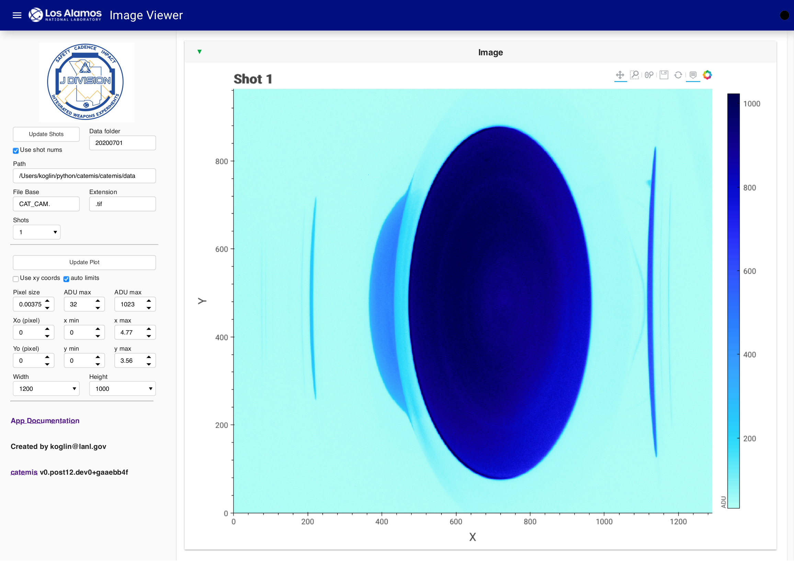

.. currentmodule:: catemis

============
Image Viewer
============

Interactive application for general image viewing can be used to view the raw cathode camera images.

Launching the Image Viewer App
------------------------------

Start the image viewer app from the catemis\\panel directory (remember to activate catemis environment for each new window)::

    $ panel serve --show image_viewer.ipynb --port=5053

.. _image_veiwer:

   Image Viewer Application

Image plotting options.
    + The file naming convention for 'Use shot nums' is FileBase.Shot.Extension (e.g., CAT_CAM.1.tif).
    + Unclick 'Use shot nums' to select by file name.
    + Conversion to Pixel size in [mm] is made when 'Use xy coords' is selected.
    + The Xo/Yo origin in pixels is used when converting to mm.
    + The X/Y min/max ranges can be used to set the base image range, 
      but the Zoom and Scroll/Zoom buttons can be used to interatively change the plot range. 

